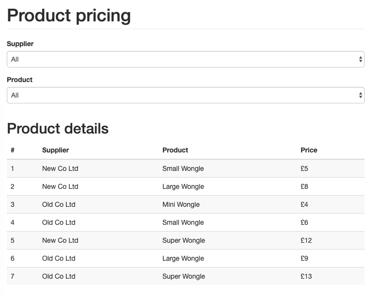

# [JDLT](https://jdlt.co.uk) full-stack developer challenge

## Instructions
Backend is pointing to the following URL for the mongo database:
``` mongodb://localhost/jdlt ```

Be sure to either set up the corresponding database on your local machine, or update the dbURI value under `config/environment.js` to your own choosing

- Install dependencies via `$ npm install`
- Seed the mongo database via `$ npm run seeds`

- Backend server is setup to run on port 8000
- Frontend server is setup to run on port 4000

You can change these values under `config/environment.js` and `webpack.config.js`

Basic scripts:
- `$ npm run back` : run back-end server
- `$ npm run front` : run front-end server


**Please demonstrate:**
- [x] Selecting suppliers and products in the drop-downs
- [x] A round-trip to a server pulling back prices
- [x] Displaying the returned data in the grid
- [x] Anything else you'd like to show us

## Demo Example



I've delivered everything in the breif, also adding a small feature to ascend/descend the search reults by price if you click on the Price column header.